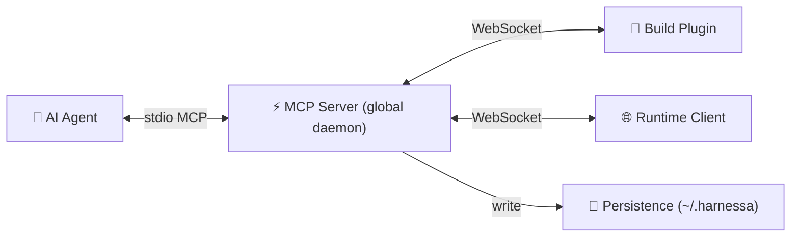

# Harnessa-FE Architecture

## System Overview

Harnessa-FE connects AI agents to a running browser session through three layers:



| Layer | Package | Role |
|-------|---------|------|
| Build Plugin | `@morphixai/harnessa-fe.vite` / `.webpack` | Source transform, HMR events, Node.js log capture |
| Runtime Client | `@morphixai/harnessa-fe.runtime` | Browser command execution, event capture |
| MCP Server | `@morphixai/harnessa-fe.mcp-server` | Global daemon: agent bridge, persistence, task management |
| Protocol | `@morphixai/harnessa-fe.protocol` | Shared types and frame schemas |
| Unplugin Core | `@morphixai/harnessa-fe.unplugin` | Shared plugin logic for all bundlers |

The MCP server is a **global daemon** — it is not tied to any single project and can serve multiple projects simultaneously.

---

## Core Concepts

### Project

A project corresponds to one frontend codebase with its own dev server.

**Identity:** A unique ID generated once by the build plugin and stored in `{projectRoot}/.harnessa-id`. This file should be committed to git so all team members share the same project ID.

**ID resolution priority:**
1. User-specified: `harnessaFE({ projectId: 'my-id' })`
2. Read from `{projectRoot}/.harnessa-id` (already exists)
3. Generate a new ID, write to `{projectRoot}/.harnessa-id`

The `.harnessa-id` file contains a single generated string (e.g., `hfe_a3f2c1d4e5b6`). It is the only file Harnessa-FE writes into the project directory.

### Session

A session is one run of the dev server — from `pnpm dev` start to process exit.

**Identity:** UUID generated by the MCP server when the build plugin sends its `hello` frame.

**Lifecycle:**
- Starts when the build plugin WebSocket connects and completes the hello handshake
- Ends when the build plugin disconnects and does not reconnect within 30 seconds
- Reconnection within 30 seconds (e.g., network blip) continues the same session
- One project has at most one active session at a time

If the runtime client connects before the build plugin, its events are held for up to 30 seconds waiting for the build plugin. If no build plugin connects, an orphan session is created.

### Tab

A tab is one browser tab that has opened the dev page.

**Identity:** A UUID generated by the runtime client in the browser and stored in `sessionStorage`. Format: `{timestamp36}-{uuid8}` to avoid collisions across sessions.

**Lifecycle:**
- Page refresh: same tab (sessionStorage persists across refreshes)
- New browser tab: new tab ID (sessionStorage is per-tab)
- Tab close and reopen: new tab ID (sessionStorage is cleared on close)

---

## Message Protocol

All communication uses JSON frames over WebSocket. Each frame has a `type` discriminator:

| Frame | Direction | Purpose |
|-------|-----------|---------|
| `hello` | peer → server | Register connection (role + projectId) |
| `hello.ack` | server → peer | Confirm registration |
| `command` | server → peer | Execute a command |
| `response` | peer → server | Return command result |
| `event` | peer → server | Push a runtime event |
| `mcp.call` / `mcp.return` | follower ↔ leader | Multi-process MCP proxy |

Peer roles: `vite-plugin`, `webpack-plugin`, `runtime-client`

---

## Data Model

### Two categories of data

**Runtime events** — time-series, append-only, generated automatically. These are observations of what happened during a session: console logs, network requests, errors, HMR updates, agent commands and responses, Node.js build logs.

**Structured records** — CRUD, managed explicitly by agent or user. These are intentional records that persist across sessions: annotation tasks submitted by users, project memory written by the agent.

These two categories are stored separately with different lifecycles and access patterns.

---

## Persistence

### Storage location

All data is stored in the global `~/.harnessa/` directory. The MCP server is a global daemon and must not write data into individual project directories (except the single `.harnessa-id` identity file).

```
~/.harnessa/
└── data/
    └── {projectId}/
        ├── meta.json           project metadata (name, path, created)
        ├── tasks.json          annotation tasks (cross-session, CRUD)
        ├── memory.json         agent memory / project notes (permanent, CRUD)
        └── sessions/
            └── {sessionId}/
                ├── meta.json       session metadata (startedAt, endedAt, bundler)
                ├── timeline.jsonl  unified event stream (all event types)
                └── tabs/
                    └── {tabId}/
                        ├── meta.json       tab metadata (url, title, userAgent)
                        ├── timeline.jsonl  tab-scoped event stream
                        └── recording.jsonl rrweb recording chunks (optional)
```

### Runtime events → JSONL timeline

All runtime events flow into a unified chronological timeline. Each line is a compact JSON object:

```jsonl
{"seq":1,"ts":1715700000100,"t":"log","tab":"tab-1","d":{"level":"info","args":["app started"]}}
{"seq":2,"ts":1715700000200,"t":"req","tab":"tab-1","d":{"method":"POST","url":"/api/login","status":200,"durationMs":45}}
{"seq":3,"ts":1715700000300,"t":"cmd","tab":"tab-1","d":{"id":"cmd-1","command":"page.click","args":{"selector":{"component":"LoginBtn"}}}}
{"seq":4,"ts":1715700000350,"t":"resp","tab":"tab-1","d":{"id":"cmd-1","ok":true,"durationMs":48}}
{"seq":5,"ts":1715700000400,"t":"err","tab":"tab-1","d":{"message":"TypeError: x is null","file":"src/App.tsx:42"}}
```

- `seq` — server-assigned monotonic sequence number (arrival order)
- `ts` — client-side timestamp (wall clock, may be slightly out of order)
- `t` — event type code
- `tab` — tab ID (omitted for session-level events like `hmr`, `node:log`)
- `d` — event payload

Event type codes:

| Code | Source | Description |
|------|--------|-------------|
| `log` | Runtime | Browser console output |
| `err` | Runtime | JavaScript error |
| `req` | Runtime | Network request |
| `hmr` | Build plugin | Hot module replacement update |
| `cmd` | MCP server | Agent command dispatched to peer |
| `resp` | MCP server | Command response received |
| `node:log` | Build plugin | Node.js stdout from dev server |
| `node:err` | Build plugin | Node.js stderr from dev server |
| `task` | Runtime | User annotation task submitted |
| `task:claim` | MCP server | Task claimed by agent |
| `task:resolve` | MCP server | Task resolved by agent |
| `rrweb` | Runtime | UI recording chunk |

### Structured records → JSON files

**tasks.json** — annotation tasks submitted by users via the browser overlay. Status flow: `pending → claimed → resolved`.

**memory.json** — key/value entries written by the agent. Used to persist project context, known issues, architectural notes, and any information the agent wants to remember across sessions.

### Write strategy

Runtime events use an **in-memory queue with async batch flush** (~16ms interval). This keeps `append()` non-blocking so WebSocket message handling and MCP response latency are not affected by I/O.

- `seq` is assigned at enqueue time to preserve arrival order regardless of flush timing
- Flushes to the same file are serialized (no concurrent writes)
- On process shutdown the queue drains before exit

Structured records (tasks, memory) use synchronous writes — they are low-frequency and correctness matters more than throughput.

---

## Data Collection

### Runtime events (automatic)

| Data | Collected by | Mechanism |
|------|-------------|-----------|
| Console logs | Runtime client | Monkey-patch `console.*` |
| Network requests | Runtime client | Monkey-patch `fetch` + `XMLHttpRequest` |
| JS errors | Runtime client | `window.onerror` + `unhandledrejection` |
| HMR events | Build plugin | Vite `handleHotUpdate` / Webpack `done` hook |
| Node.js logs | Build plugin | Intercept `process.stdout/stderr` |
| Agent commands | MCP server | Captured in `sendCommand()` before dispatch |
| Command responses | MCP server | Captured in `sendCommand()` on resolution |

### Structured records (explicit)

| Data | Written by | Trigger |
|------|-----------|---------|
| Tasks | Runtime client | User submits via annotation overlay |
| Task status changes | MCP server | Agent calls `tasks.claim` / `tasks.resolve` |
| Project memory | Agent | Agent calls `project.memory.set` |

---

## MCP Tools

### Live data (in-memory RingBuffer, current session only)

| Tool | Description |
|------|-------------|
| `console.tail` | Last N browser console entries |
| `network.tail` | Last N network requests |
| `errors.tail` | Last N JS errors |
| `tab.list` | Currently connected browser tabs |

### Historical data (JSONL store, queryable across sessions)

| Tool | Description |
|------|-------------|
| `session.list` | Recent sessions for a project |
| `session.summary` | Event counts and last error for a session |
| `session.tail` | Last N events from timeline (filterable by type) |
| `session.search` | Search timeline by keyword |
| `session.purge` | Delete old sessions to free disk space |
| `project.sessions` | All projects with recent session info |

### Source intelligence (from build plugin)

| Tool | Description |
|------|-------------|
| `project.source` | Read source file by path or component name |
| `project.where_is` | Find file:line:col for a component |
| `project.module_graph` | All discovered components and locations |

### Browser control (to runtime client)

| Tool | Description |
|------|-------------|
| `page.click` | Click a DOM element |
| `page.type` | Type into an input |
| `page.evaluate` | Execute JavaScript in page context |
| `page.screenshot` | Capture a screenshot |
| `page.dom_query` | Query DOM elements, returns outerHTML |
| `page.wait_for` | Wait for a condition |

### Tasks

| Tool | Description |
|------|-------------|
| `tasks.pending` | List annotation tasks (filterable by status) |
| `tasks.claim` | Claim a task (mark as in-progress) |
| `tasks.resolve` | Resolve a task with a note |

### Project memory

| Tool | Description |
|------|-------------|
| `project.memory.set` | Write or update a memory entry |
| `project.memory.get` | Read a specific memory entry by key |
| `project.memory.list` | List all memory entries for a project |
| `project.memory.delete` | Delete a memory entry |

---

## Retention Policy

| Data | Default retention |
|------|------------------|
| Session timelines | 7 days |
| rrweb recordings | 3 days |
| Max sessions per project | 20 |
| Resolved tasks | 30 days |
| Project memory | Permanent |

---

## Adding a New Build Plugin

1. Use the unplugin adapter — `@morphixai/harnessa-fe.unplugin` exports adapters for Vite, Webpack, Rspack, esbuild, Rollup
2. Add the peer role to `peerRoleSchema` in the protocol package
3. Update `SessionRouter` to route commands to the new role
4. Create a thin wrapper package (e.g., `@morphixai/harnessa-fe.rspack`)
5. Add a demo in `examples/{bundler}-demo/` to verify the full closed loop

---

## Migration Path to Server Mode

The MCP server is currently a local process. The persistence layer (`IStore`) is backend-agnostic by design.

```
Phase 1 (current)   Local daemon, JSONL + JSON files in ~/.harnessa/
Phase 2             Remote store behind same IStore interface (PostgreSQL / ClickHouse)
Phase 3             Hosted MCP server, multi-tenant, object storage for recordings
```

No changes to the bridge, MCP tools, or client code are needed when switching store backends.
