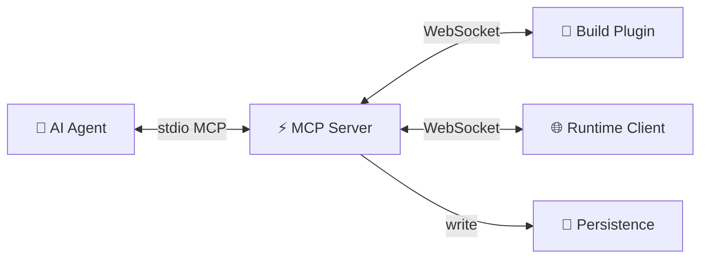

# Harnessa-FE Architecture

## System Overview

Harnessa-FE connects AI agents to a running browser session through three layers:



| Layer | Package | Role |
|-------|---------|------|
| Build Plugin | `@morphixai/harnessa-fe.vite` / `.webpack` | Source transform, HMR events, Node.js log capture |
| Runtime Client | `@morphixai/harnessa-fe.runtime` | Browser command execution, event capture |
| MCP Server | `@morphixai/harnessa-fe.mcp-server` | Agent bridge, persistence, task management |
| Protocol | `@morphixai/harnessa-fe.protocol` | Shared types and frame schemas |
| Unplugin Core | `@morphixai/harnessa-fe.unplugin` | Shared plugin logic for all bundlers |

---

## Message Protocol

All communication uses JSON frames over WebSocket. Each frame has a `type` discriminator:

| Frame | Direction | Purpose |
|-------|-----------|---------|
| `hello` | peer → server | Register connection (role + projectId) |
| `hello.ack` | server → peer | Confirm registration |
| `command` | server → peer | Execute a command |
| `response` | peer → server | Return command result |
| `event` | peer → server | Push a runtime event |
| `mcp.call` / `mcp.return` | follower ↔ leader | Multi-process MCP proxy |

Peer roles: `vite-plugin`, `webpack-plugin`, `runtime-client`

---

## Data Model

### Two categories of data

**1. Runtime events** — time-series, append-only, generated automatically during a dev session.

Examples: console logs, network requests, JS errors, HMR updates, agent commands and responses, Node.js build logs.

**2. Structured records** — CRUD, managed explicitly by agent or user.

Examples: annotation tasks (user-submitted), project memory (agent-written notes).

These two categories are stored separately and have different lifecycles.

---

## Persistence Design

### Directory layout

```
~/.harnessa-fe/data/
└── {projectId}/
    ├── tasks.json          structured: annotation tasks (cross-session)
    ├── memory.json         structured: project memory / agent notes (permanent)
    └── sessions/
        └── {sessionId}/
            ├── meta.json   session metadata
            ├── timeline.jsonl   runtime event stream (session-level)
            └── tabs/
                └── {tabId}/
                    ├── timeline.jsonl   runtime event stream (tab-level)
                    └── recording.jsonl  rrweb recording chunks
```

### Runtime events → JSONL timeline

All runtime events are appended to the session and tab timelines as a unified chronological stream. Every line is a JSON object with a `ts` (client timestamp) and `t` (event type code).

Event type codes:

| Code | Source | Description |
|------|--------|-------------|
| `log` | Runtime | Browser console output |
| `err` | Runtime | JavaScript error |
| `req` | Runtime | Network request |
| `hmr` | Build plugin | Hot module replacement |
| `cmd` | MCP server | Agent command dispatched |
| `resp` | MCP server | Command response received |
| `node:log` | Build plugin | Node.js stdout |
| `node:err` | Build plugin | Node.js stderr |
| `task` | Runtime | User annotation submitted |
| `task:claim` | MCP server | Task claimed by agent |
| `task:resolve` | MCP server | Task resolved |
| `rrweb` | Runtime | UI recording chunk |

### Structured records → JSON files

**tasks.json** — annotation tasks submitted by users from the browser. Supports status flow: `pending → claimed → resolved`.

**memory.json** — key/value notes written by the agent across sessions. Used to persist project context, known issues, architectural decisions, etc.

---

## Write Strategy

Runtime events are written via an **in-memory queue with async batch flush** (every ~16ms). This avoids blocking the Node.js event loop on every event, which would degrade WebSocket responsiveness and MCP latency.

Key properties:
- `append()` is non-blocking — events are queued in memory and returned immediately
- A monotonic `seq` number is assigned at queue time (not flush time) to preserve arrival order
- Flush is serialized per file — concurrent flushes to the same file are not possible
- On process shutdown, the queue is drained synchronously before exit to prevent data loss

Structured records (tasks, memory) use synchronous writes since they are low-frequency.

---

## Data Collection

### Runtime events (automatic)

| Data | Collected by | How |
|------|-------------|-----|
| Console logs | Runtime client | Monkey-patch `console.*` |
| Network requests | Runtime client | Monkey-patch `fetch` + `XMLHttpRequest` |
| JS errors | Runtime client | `window.onerror` + `unhandledrejection` |
| HMR events | Build plugin | Vite `handleHotUpdate` / Webpack `done` hook |
| Node.js logs | Build plugin | Intercept `process.stdout/stderr` |
| Agent commands | MCP server | Captured in `sendCommand()` before dispatch |
| Command responses | MCP server | Captured in `sendCommand()` on resolution |

### Structured records (explicit)

| Data | Written by | When |
|------|-----------|------|
| Tasks | Runtime client | User clicks annotation overlay |
| Task status | MCP server | Agent calls `tasks.claim` / `tasks.resolve` |
| Project memory | Agent | Agent calls `project.memory.set` |

---

## MCP Tools

### Live data (from in-memory RingBuffer)

| Tool | Description |
|------|-------------|
| `console.tail` | Last N browser console entries |
| `network.tail` | Last N network requests |
| `errors.tail` | Last N JS errors |
| `tab.list` | Connected browser tabs |

### Historical data (from JSONL store)

| Tool | Description |
|------|-------------|
| `session.list` | Recent sessions for a project |
| `session.summary` | Event counts and last error for a session |
| `session.tail` | Last N events from timeline (filterable by type) |
| `session.search` | Search timeline by keyword |
| `session.purge` | Delete old sessions |
| `project.sessions` | All projects with recent session info |

### Source intelligence (from build plugin)

| Tool | Description |
|------|-------------|
| `project.source` | Read source file by path or component name |
| `project.where_is` | Find file:line:col for a component |
| `project.module_graph` | All discovered components and locations |

### Browser control (to runtime client)

| Tool | Description |
|------|-------------|
| `page.click` | Click a DOM element |
| `page.type` | Type into an input |
| `page.evaluate` | Execute JavaScript |
| `page.screenshot` | Capture screenshot |
| `page.dom_query` | Query DOM, returns outerHTML |
| `page.wait_for` | Wait for a condition |

### Tasks

| Tool | Description |
|------|-------------|
| `tasks.pending` | List annotation tasks |
| `tasks.claim` | Claim a task |
| `tasks.resolve` | Resolve a task with a note |

### Project memory

| Tool | Description |
|------|-------------|
| `project.memory.set` | Write a memory entry |
| `project.memory.get` | Read a memory entry |
| `project.memory.list` | List all memory entries |
| `project.memory.delete` | Delete a memory entry |

---

## Retention Policy

| Data | Default retention |
|------|------------------|
| Session timelines | 7 days |
| rrweb recordings | 3 days |
| Max sessions per project | 20 |
| Resolved tasks | 30 days |
| Project memory | Permanent |

---

## Adding a New Build Plugin

1. Use the unplugin adapter — `@morphixai/harnessa-fe.unplugin` already supports Vite, Webpack, Rspack, esbuild, Rollup
2. Add the peer role to `peerRoleSchema` in the protocol package
3. Update `SessionRouter.findBuildPlugin()` to include the new role
4. Create a thin wrapper package (e.g., `@morphixai/harnessa-fe.rspack`)
5. Add a demo app in `examples/{bundler}-demo/` to verify the closed loop

---

## Migration Path to Server Mode

The current architecture is fully local. The `IStore` interface is designed to be backend-agnostic.

```
Phase 1 (current)  Local JSONL files + JSON files
Phase 2            Remote store (PostgreSQL/ClickHouse) behind same IStore interface
Phase 3            Hosted MCP server, multi-tenant, object storage for recordings
```

No changes to the bridge, MCP tools, or client code are needed when switching store backends.
