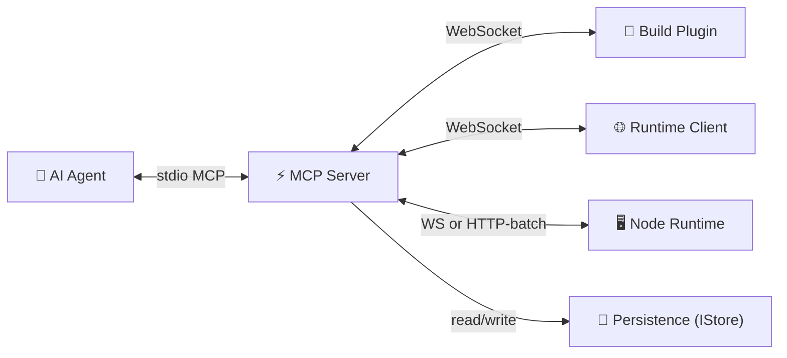

# Harnessa-FE Architecture

## Layers



| Layer | Package | Responsibility |
|-------|---------|---------------|
| Build Plugin | `@harnessa-fe/vite` / `.webpack` | Source-aware transform at build time; forward HMR + Node.js logs; report `projectId` / `buildId` / `parentProjectId` to daemon |
| Runtime Client | `@harnessa-fe/runtime` | Capture browser events (console / network / errors / rrweb); execute agent commands; **inherit identity from same-origin parent iframe** |
| Node Runtime | `@harnessa-fe/node-runtime` | Server-side capture (`uncaughtException`, `unhandledRejection`, `console.*`, Route Handler traces); ALS + provider-based `sessionId` resolution; dual transport (WS / HTTP-batch for Edge) |
| Framework Adapter | `@harnessa-fe/next` | Bridges Next.js into the runtime: `<HarnessaScript>` Server Component seeds the same `sessionId` into SSR HTML and the client; `setSessionIdProvider` DI plugs Next's `cache()`-backed getter into node-runtime |
| User API | `@harnessa-fe/log` | Isomorphic structured logger; same `log.info(...)` in Server Components, Route Handlers, and Client Components; delegates `sessionId` resolution to the runtimes |
| MCP Server | `@harnessa-fe/mcp-server` | Global daemon; bridges agent ↔ peers; owns persistence (`IStore`) + project tree |
| Unplugin Core | `@harnessa-fe/unplugin` | Shared transform + WebSocket lifecycle for every bundler; resolves `buildId` |
| Protocol | `@harnessa-fe/protocol` | Wire frames + Zod schemas + URL helpers |
| JSX Runtime | `@harnessa-fe/react-jsx` | `jsxImportSource` adapter that tags every React element with `data-morphix-loc` / `data-morphix-comp` — works in any React 17+ toolchain without a bundler plugin |
| Agent Playbook | `@harnessa-fe/skill` | Standalone npm — drops a `SKILL.md` into agent projects teaching them how to use the Harnessa MCP toolset |

The MCP server is a **global daemon** — not tied to any single project. Multiple projects share one process.

---

## Core narrative concepts

```
Project              ← stable identity for a codebase (UUID, .harnessa-id)
  ├─ parentProjectId? ← project tree, supports micro-frontends
  ├─ displayName?     ← human-readable label (defaults to package.json `name`)
  └─ Builds           ← one source-code snapshot per dev-server start / per prod build
        └─ buildId    ← stable across HMR, changes on restart / re-build

Tab                  ← one browser tab lifecycle (persists across refresh)
  └─ tabId           ← sessionStorage-backed; inherited from window.parent in same-origin iframes
       └─ Sessions   ← one page-load each (narrative unit for "what happened in one bug")
            └─ sessionId  ← regenerated on every navigation/refresh; inherited from parent for iframes
                 └─ events: console / network / rrweb / errors / commands
                          ← each row tagged with projectId + buildId
```

**Why this shape**: agent debugging asks "what happened in one user session, across all the apps that were running?". Answer = filter all events for a given `sessionId` (or `tabId`, or `projectId+descendants`).

### Same-origin iframe identity inheritance

When the runtime boots inside a same-origin iframe, `tryInheritFromParent()` reads:

- `window.parent.__harnessa_fe_client__.tabId` / `.sessionId`
- `window.parent.__hfe_session_id__` (fallback if client global isn't set yet)
- `window.parent.sessionStorage['__hfe_tab_id__']` (fallback)
- `window.parent.__HARNESSA_FE__.projectId` → reported as `parentProjectId`

Cross-origin parent → `SecurityError` caught silently → child generates its own identity.

The parent runtime exposes itself on `window.__harnessa_fe_client__` and `window.__hfe_session_id__` precisely so children can read these.

---

## sessionId resolution (server side)

The defining property of Harnessa: **one page-load = one sessionId, and every event from that page-load (server + client + iframe) carries it**. The mechanism on the server side is layered:

```
                              getRequestSessionId()
                                       │
                       ┌───────────────┴───────────────┐
                       ▼                               ▼
        1. AsyncLocalStorage                  2. Adapter-supplied provider
           (explicit user intent —             (Next: React cache()-backed
            withHarnessaTracing wraps           getter; pushed in via
            a handler)                          setSessionIdProvider)
                       │                               │
                       └───────────┬───────────────────┘
                                   ▼
                       3. undefined → orphan event
                       (filed under sessions/server-orphans/)
```

**Why ALS wins**: explicit user intent. If a developer wraps a handler in `withHarnessaTracing`, they want that exact id used.

**The DI direction matters**: `@harnessa-fe/node-runtime` does NOT import `@harnessa-fe/next`. Instead, the Next adapter's `sessionId.ts` module has a side-effect `try { require('@harnessa-fe/node-runtime').setSessionIdProvider(getSessionId) }` that fires on first `<HarnessaScript>` render. Dependency direction is L2 framework adapter → L1 runtime SDK (correct); node-runtime stays React-agnostic.

**One-request lifecycle**:

```
request arrives
  │
  ▼
<HarnessaScript> renders (Server Component)
  ├─ ensureNodeRuntimeBooted() ─ first-render-only register() of node-runtime
  ├─ side-effect import './sessionId.js' ─ setSessionIdProvider(getSessionId)
  └─ getSessionId() ────────► cache() allocates sid-X for this render scope
                                                │
                                                ▼
                                       seed: window.__HARNESSA_FE_SEED__ = { sessionId: 'sid-X' }
                                                │
Server Component renders, fires console.log    │
        └─► node-runtime.getRequestSessionId() reads provider → 'sid-X'
                                                │
HTML reaches browser                            │
        └─► <HarnessaScriptClient> hydrates → adopts seed → window.__harnessa_fe_client__.sessionId = 'sid-X'
                                                │
Client console.log / log.info                  │
        └─► runtime-client.sendEvent stamps 'sid-X'
                                                ▼
                          One sessions/sid-X/timeline.jsonl with all events
```

**Cross-request isolation**: React `cache()` is request-scoped via `AsyncLocalStorage` under the hood. Two tabs hitting the same Next process in parallel get separate cache scopes; their `console.log` / `log.info` rows go to separate session timelines. Verified by `@harnessa-fe/node-runtime` test suite (28 cases, including a `Promise.all([renderA, renderB])` interleaved-`console.log` case).

**Orphans are correct**: a `log.info()` from a background timer, cold-start init, or post-response callback has no request to belong to. Marking it `sessionId: undefined` and filing under `server-orphans/` is more honest than guessing.

---

## Event types

| Event | Source | Tagged as |
|---|---|---|
| `console` | Browser `console.*` (auto-captured by runtime-client) | `t: 'console'` |
| `network` | Browser `fetch` / XHR (auto-captured) | `t: 'network'` |
| `app-log` | Explicit `log.*` calls via `@harnessa-fe/log` (browser or server) | `t: 'app-log'` |
| `server-log` | Server-side `console.*` (auto-captured by node-runtime) | `t: 'server-log'` |
| `server-err` | `uncaughtException` / `unhandledRejection` / explicit `reportError` | `t: 'server-err'` |
| `server-action` | Handler wrapped in `withHarnessaTracing` — duration + status | `t: 'server-action'` |
| `task` | User submitting an annotated screenshot via the overlay | `t: 'task'` |
| `rrweb` | Browser DOM snapshots (one chunk every few seconds) | written to `recording.jsonl` |

`app-log` vs `server-log` distinction lets agents answer "show me the developer's explicit `log.warn` calls" separately from "all server output including framework noise".

---

## Module Interactions

### Build Plugin → MCP Server

- Sends `hello` on startup: `{ projectId, parentProjectId?, displayName?, buildId }`
- Forwards HMR updates and Node.js stdout/stderr as event frames (each tagged with `buildId`)
- Responds to source-intelligence commands: `project.source` / `project.where_is` / `project.module_graph`

### Runtime Client → MCP Server

- Sends `hello` on page load: `{ projectId, parentProjectId?, displayName?, buildId, tabId, sessionId, visitorId?, userId?, env? }`
- Streams `console.*`, `fetch`/XHR, `window.error`, `unhandledrejection` events; each row tagged with `projectId` + `sessionId` + `buildId` + `visitorId`
- Captures rrweb chunks per pageload (one `recording.jsonl` per `sessionId`)
- Hosts the in-page overlay: "H" mark → info card → "Report a problem" picker → snapdom screenshot → arrow/text annotation → flattened PNG attachment on `task.submit`
- Executes commands dispatched by the server (`page.click`, `page.type`, …)
- Issues `query` frames (`tasks.mine` / `tasks.update` / `tasks.delete`) for the user's self-managed reports view; daemon enforces visitor-owner check

### Node Runtime → MCP Server

`@harnessa-fe/node-runtime` boots from Next's `instrumentation.ts` (or auto-injected via `withHarnessa(next.config)`). It picks a transport at startup:

| Transport | When | Wire |
|---|---|---|
| **WS** | Node runtime (default) | Same WebSocket as the browser SDK, role `node-runtime` |
| **HTTP-batch** | Edge Runtime (`process.env.NEXT_RUNTIME === 'edge'`) or `HARNESSA_FE_TRANSPORT=http`, or when `require('ws')` fails | `POST /events` on the daemon, batches every 500 ms / 50 events, retries on 5xx with exp backoff |

Both transports emit the same `EventFrame` shape. Daemon's `bridge.ts` accepts `role: 'node-runtime'` hellos and joins the existing `SessionMeta` when sessionIds match the client side.

**Session continuity** between server and client for a single refresh: `<HarnessaScript>` is a Server Component that calls a `React.cache()`-backed `getSessionId()` to allocate one stable id per request render, inlines a `<script>window.__HARNESSA_FE_SEED__ = { sessionId }</script>` before any client code runs, and the browser-side runtime adopts that seed via `tryAdoptServerSeed()`. The Node SDK reads from the same `cache()`, so server logs and client logs for one refresh land in **one** `~/.harnessa/data/sessions/{sessionId}/timeline.jsonl`.

Errors captured by the Node SDK (default-on): `process.on('uncaughtException')` / `unhandledRejection`. Errors thrown inside a Server Component render are caught by the SDK's React error boundary integration. Console output is opt-in via `HARNESSA_FE_NODE_CONSOLE=1`. Route Handlers / Server Actions can be wrapped with `withHarnessaTracing(handler)` for per-call duration + error events.

### MCP Server → AI Agent (stdio MCP tools)

Tool groups:

| Group | Tools |
|---|---|
| Page interaction | `page.click` / `type` / `scroll` / `navigate` / `reload` / `evaluate` / `wait_for` / `screenshot` / `dom_query` / `pick_element` |
| Telemetry | `console.tail` / `network.tail` / `errors.tail` |
| Session replay | `session.recordings.list` / `slice` / `replay.create` |
| Source intelligence | `project.source` / `where_is` / `module_graph` / `snapshot` |
| **Project tree** | `project.list` / `get` / `tree` / `set_parent` |
| **Builds** | `build.list` / `build.get` |
| Tasks | `tasks.pending` / `claim` / `resolve` |
| Memory | `project.memory.set` / `get` / `list` / `delete` |

---

## Persistence (`IStore`)

All data lives in `~/.harnessa/data/` — the daemon's global directory. Projects write only a single `.harnessa-id` to their own root.

### Disk layout (v0.7+)

```
~/.harnessa/data/
├── projects/
│   └── {projectId}/
│       ├── meta.json                       ProjectMeta — id, parentProjectId, displayName, tags
│       ├── tasks.json                      Annotation task queue
│       ├── memory.json                     Agent long-term key-value memory
│       ├── notes.jsonl                     Project-level cross-session notes
│       ├── builds/
│       │   └── {buildId}/meta.json         BuildMeta — gitSha, dirty, bundler, sourceDigest
│       └── task-attachments/
│           └── {taskId}/{attachmentId}.png Annotated screenshots (flattened)
├── tabs/
│   └── {tabId}/
│       └── meta.json                       TabMeta — userAgent, connectedAt; spans many sessions
├── visitors/
│   └── {visitorId}/
│       └── meta.json                       VisitorMeta — anonymous UUID + optional userId, env snapshot, journey index
├── sessions/
│   └── {sessionId}/                        One pageload = one bucket
│       ├── meta.json                       SessionMeta — tabId, url, participants[{ projectId, buildId }]
│       ├── timeline.jsonl                  Parent + iframe + server events, each line tagged with projectId+buildId+visitorId
│       └── recording.jsonl                 rrweb chunks for this pageload
└── exports/                                Replay export bundles (rrweb)
```

**Key design properties**:
- Sessions are top-level (one pageload = one bucket); `projects/`, `tabs/`, `visitors/` are sibling top-level dirs holding metadata only — they don't own events.
- Every event line carries row-level `projectId`, `buildId`, `visitorId` so cross-cutting queries filter row-side with no merge.
- Parent + same-origin iframe runtimes share `sessionId` (via `tryInheritFromParent`) → their events land in the **same** `timeline.jsonl`.
- Server-side events from `@harnessa-fe/node-runtime` (Node OR Edge via HTTP-batch) land in the SAME `sessions/{sessionId}/timeline.jsonl` as the matching browser-side events for that pageload (via the `cache()` seed mechanism).
- `visitors/` stitches user activity across refreshes / tabs / iframes; agents query via `visitor.list` / `visitor.get` / `visitor.journey`.
- v0.7 dropped pre-1.0 read-compat for pre-0.4 disk layouts; existing data older than that needs `rm -rf ~/.harnessa/data`.

### Storage strategy

- **Runtime events** (high-frequency time-series) → JSONL append-only, written via `WriteQueue` (single-writer-per-file)
- **Structured records** (CRUD) → JSON, atomic write-then-rename
- **In-memory state** — `SessionRouter` tracks active peers (live view); disk is the historical truth

### IStore interface (excerpt)

```ts
upsertProject(projectId, patch)         // merging; rejects parent-tree cycles
getProject(projectId)
listProjects()

upsertBuild(projectId, buildId, patch)
getBuild / listBuilds

getProjectTree(rootId?)                 // forest assembled from parentProjectId

openSession(...) / openTab / openLoad   // event-stream lifecycle
append / appendBatch / appendRecording  // events + rrweb
tail / search / listRecordings / sliceRecordings / sliceRecordingsByLoad
```

The interface is the boundary for future backends — `SqliteStore` / `PostgresStore` / `RemoteHttpStore` can implement the same shape without touching upstream code. The schema is SQL-friendly (see CHANGELOG `Unreleased` notes).

---

## Configuration

### URL-based (v0.2+)

A single env var governs the daemon ↔ plugin handshake:

| Env var | Default | Meaning |
|---|---|---|
| `HARNESSA_FE_URL` | `ws://127.0.0.1:47729` | WebSocket URL the daemon listens on AND the plugins/runtimes connect to |

The plugin can also accept an explicit option:

```ts
harnessaFE({ mcpUrl: 'ws://10.0.0.5:9000' })
```

Resolution order (highest first):

1. `harnessaFE({ mcpUrl: '…' })` plugin option
2. `HARNESSA_FE_URL` env var
3. Default `ws://127.0.0.1:47729`

Earlier `HARNESSA_FE_HOST` + `HARNESSA_FE_PORT` were dropped in favor of the single URL.

---

## Key design decisions

- **Single source of truth on disk** — events are append-only JSONL; indexes are derivable, not persisted. Multi-instance deployments share storage without sync.
- **`IStore` is the only abstraction across implementations** — JSONL today, SQL tomorrow. No file-path leakage above the store.
- **`buildId` is independent of `sessionId`** — separates "which code ran" from "which page-load" so prod-style debugging works (`build.list`, future `build.timeline`).
- **Identity inheritance happens in the runtime, not on the wire** — protocol stays simple; iframe correlation is a client concern.
- **Unplugin** — one plugin codebase → Vite / Webpack / Rspack / esbuild / Rollup adapters
- **JSONL timeline** — agents read events linearly; no query DSL required
- **Global daemon** — MCP server isn't project-scoped; multiple projects share one process
- **`.harnessa-id`** — only file written into the user's project directory; everything else lives under `~/.harnessa/`
