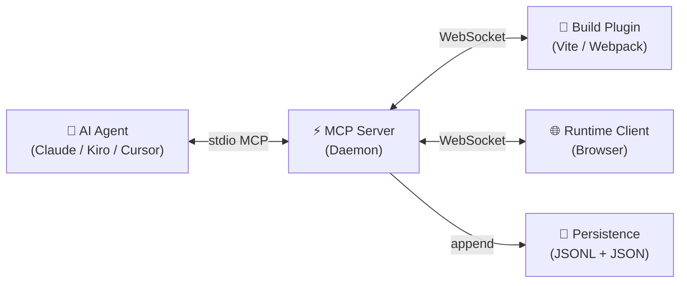
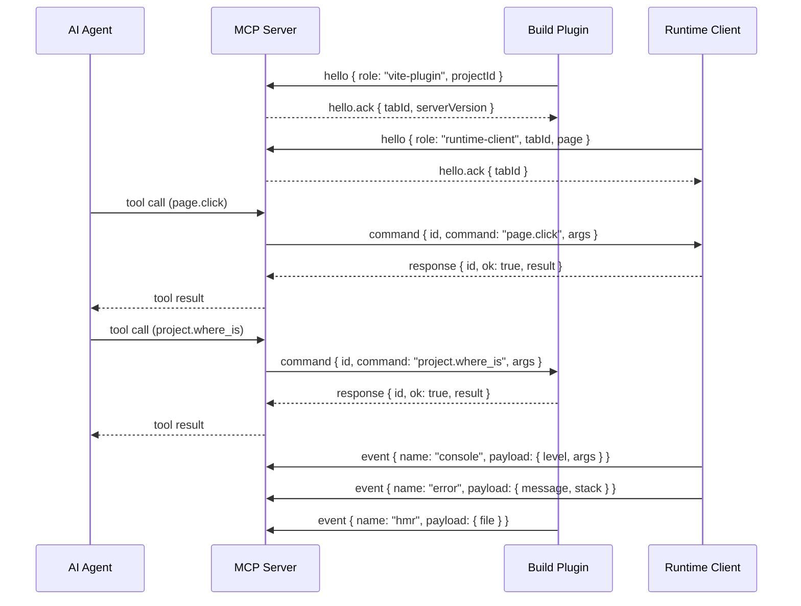

# Harnessa-FE Architecture

## Overview

Harnessa-FE is a frontend harness toolkit that makes web applications agent-readable. It connects AI agents (Claude, Cursor, Kiro) to a running browser session through a three-layer architecture: build plugin → runtime client → MCP server.



---

## Packages

### `@morphixai/harnessa-fe.protocol`

Zero-dependency shared types and Zod schemas used by all other packages.

- WebSocket frame types: `hello`, `hello.ack`, `command`, `response`, `event`, `mcp.call`, `mcp.return`
- Selector types for DOM targeting: `css`, `component`, `role`, `text`, `loc`
- Command name constants (`COMMAND.*`)
- Peer role enum: `vite-plugin`, `webpack-plugin`, `runtime-client`

### `@morphixai/harnessa-fe.unplugin`

Unified build plugin core using [unplugin](https://github.com/unjs/unplugin). Contains all plugin logic shared across bundlers:

- **JSX transform** — injects `data-morphix-loc` and `data-morphix-comp` attributes into JSX elements at build time
- **Vue SFC transform** — same for Vue 3 Single File Components
- **WebSocket lifecycle** — connects to MCP server, sends hello frame, handles reconnect
- **HTML injection** — injects `window.__HARNESSA_FE__` config + runtime client script tag
- **HMR/error forwarding** — sends build events to MCP server
- **Command handling** — responds to `project.source`, `project.where_is`, `project.module_graph`

Exports bundler-specific adapters:

```typescript
import { harnessaFE } from '@morphixai/harnessa-fe.unplugin/vite'
import { harnessaFE } from '@morphixai/harnessa-fe.unplugin/webpack'
import { harnessaFE } from '@morphixai/harnessa-fe.unplugin/rspack'
```

### `@morphixai/harnessa-fe.vite`

Thin wrapper over `@morphixai/harnessa-fe.unplugin/vite`. User-facing package for Vite projects.

### `@morphixai/harnessa-fe.webpack`

Thin wrapper over `@morphixai/harnessa-fe.unplugin/webpack`. User-facing package for Webpack 5 projects.

### `@morphixai/harnessa-fe.runtime`

Browser-side SDK injected into the dev page by the build plugin.

- Connects to MCP server via WebSocket
- Captures console logs, network requests, JS errors (monkey-patches)
- Executes commands: `page.click`, `page.type`, `page.evaluate`, `page.screenshot`, `page.dom_query`, `page.wait_for`
- Sends captured events as event frames to MCP server
- Handles annotation overlay for user task submission

### `@morphixai/harnessa-fe.mcp-server`

The central daemon. Bridges AI agents (stdio MCP) with browser/plugin peers (WebSocket).

- Accepts WebSocket connections from build plugins and runtime clients
- Registers peers in `SessionRouter` (tracks active tabs and build plugins)
- Routes MCP tool calls to the correct peer
- Persists all runtime data to the store
- Manages task queue (user-submitted annotation tasks)

---

## Message Flow



---

## Protocol Frame Types

| Frame | Direction | Required Fields | Purpose |
|-------|-----------|----------------|---------|
| `hello` | peer → server | `id`, `role`, `projectId` | Register a peer connection |
| `hello.ack` | server → peer | `id`, `serverVersion` | Confirm registration, assign tabId |
| `command` | server → peer | `id`, `command`, `args` | Execute a command on the peer |
| `response` | peer → server | `id`, `ok`, `result`/`error` | Return command result |
| `event` | peer → server | `id`, `name`, `ts`, `payload` | Push a runtime event |
| `mcp.call` | follower → leader | `id`, `method`, `args` | Proxy MCP method call |
| `mcp.return` | leader → follower | `id`, `ok`, `result`/`error` | Return proxied result |

---

## Persistence Architecture

### Design Principles

1. **JSONL for time-series data** — append-only, human-readable, Agent-friendly
2. **JSON files for structured data** — tasks and project memory need CRUD, not append
3. **Directory hierarchy mirrors data hierarchy** — project → session → tab
4. **Agent can read files directly** — no query language needed for simple cases

### Directory Layout

```
~/.harnessa-fe/data/
└── {projectId}/
    ├── meta.json                          project metadata (created, lastActive)
    ├── tasks.json                         all tasks for this project (cross-session)
    ├── memory.json                        project memory / agent notes (cross-session)
    └── sessions/
        └── {sessionId}/
            ├── meta.json                  session metadata (startedAt, endedAt, peerRole)
            ├── timeline.jsonl             unified event timeline (all event types)
            └── tabs/
                └── {tabId}/
                    ├── meta.json          tab metadata (url, title, userAgent)
                    ├── timeline.jsonl     tab-scoped event timeline
                    └── recording.jsonl    rrweb recording chunks (optional)
```

### Data Types and Storage

| Data | Type | Storage | Retention |
|------|------|---------|-----------|
| Console logs | Time-series | `timeline.jsonl` | 7 days |
| Network requests | Time-series | `timeline.jsonl` | 7 days |
| JS errors | Time-series | `timeline.jsonl` | 7 days |
| HMR events | Time-series | `timeline.jsonl` | 7 days |
| Agent commands | Time-series | `timeline.jsonl` | 7 days |
| Command responses | Time-series | `timeline.jsonl` | 7 days |
| Node.js logs | Time-series | `timeline.jsonl` | 7 days |
| rrweb recordings | Time-series | `recording.jsonl` | 3 days |
| Tasks | Structured | `tasks.json` | 30 days (resolved) |
| Project memory | Structured | `memory.json` | Permanent |

### JSONL Timeline Format

Every event line has a minimal envelope:

```jsonl
{"ts":1715700000100,"t":"log","tab":"tab-abc","d":{"level":"info","args":["app started"]}}
{"ts":1715700000200,"t":"req","tab":"tab-abc","d":{"method":"POST","url":"/api/login","status":200,"durationMs":45}}
{"ts":1715700000300,"t":"err","tab":"tab-abc","d":{"message":"TypeError: x is null","stack":"..."}}
{"ts":1715700000400,"t":"cmd","tab":"tab-abc","d":{"id":"cmd-1","command":"page.click","args":{"selector":{"component":"LoginBtn"}}}}
{"ts":1715700000450,"t":"resp","tab":"tab-abc","d":{"id":"cmd-1","ok":true,"result":{"via":"component"},"durationMs":48}}
{"ts":1715700000500,"t":"hmr","d":{"file":"src/App.tsx","type":"update"}}
{"ts":1715700000600,"t":"node:log","d":{"level":"info","msg":"vite: page reload"}}
```

**Event type codes:**

| Code | Source | Description |
|------|--------|-------------|
| `log` | Runtime | Browser console output |
| `err` | Runtime | JavaScript error or unhandled rejection |
| `req` | Runtime | Network request (fetch/XHR) |
| `hmr` | Build plugin | Hot module replacement update |
| `cmd` | MCP server | Agent command dispatched to peer |
| `resp` | MCP server | Command response received |
| `node:log` | Build plugin | Node.js stdout from dev server |
| `node:err` | Build plugin | Node.js stderr from dev server |
| `task` | Runtime | User annotation task submitted |
| `task:claim` | MCP server | Task claimed by agent |
| `task:resolve` | MCP server | Task resolved by agent |
| `rrweb` | Runtime | rrweb recording chunk |

### tasks.json Format

```json
{
  "version": 1,
  "tasks": [
    {
      "id": "abc123",
      "sessionId": "sess-001",
      "tabId": "tab-001",
      "projectId": "my-app",
      "status": "pending",
      "question": "This button does nothing when clicked",
      "url": "http://localhost:5173/dashboard",
      "selector": { "comp": "SubmitBtn", "css": "button[type=submit]" },
      "element": {
        "tag": "button",
        "outerHTML": "<button type=\"submit\" data-morphix-comp=\"SubmitBtn\">Submit</button>"
      },
      "createdAt": 1715700000000,
      "claimedAt": null,
      "resolvedAt": null,
      "note": null
    }
  ]
}
```

**Task status flow:**

```
pending → claimed → resolved
```

### memory.json Format

```json
{
  "version": 1,
  "entries": [
    {
      "id": "mem-001",
      "key": "known_bugs",
      "value": "Login button unresponsive on Safari 15 — CSS pointer-events override issue",
      "createdAt": 1715700000000,
      "updatedAt": 1715700000000
    },
    {
      "id": "mem-002",
      "key": "architecture",
      "value": "React 18 + Vite 7, state management with Zustand, API layer with React Query",
      "createdAt": 1715700000000,
      "updatedAt": 1715700000000
    },
    {
      "id": "mem-003",
      "key": "agent_context",
      "value": "User prefers component-level selectors over CSS selectors. Main pain point is the checkout flow.",
      "createdAt": 1715700000000,
      "updatedAt": 1715710000000
    }
  ]
}
```

---

## MCP Tools Reference

### Browser Interaction

| Tool | Description |
|------|-------------|
| `page.click` | Click a DOM element by selector |
| `page.type` | Type text into an input |
| `page.evaluate` | Execute JavaScript in page context |
| `page.wait_for` | Wait for a condition |
| `page.screenshot` | Capture a screenshot |
| `page.dom_query` | Query DOM elements, returns outerHTML |
| `tab.list` | List connected browser tabs |

### Source Intelligence

| Tool | Description |
|------|-------------|
| `project.source` | Read source file by path or component name |
| `project.where_is` | Find file:line:col for a component |
| `project.module_graph` | Get all discovered components and locations |

### Runtime Capture (live, from RingBuffer)

| Tool | Description |
|------|-------------|
| `console.tail` | Last N browser console entries |
| `network.tail` | Last N network requests |
| `errors.tail` | Last N JavaScript errors |

### Persistence (historical, from JSONL store)

| Tool | Description |
|------|-------------|
| `session.list` | List recent sessions for a project |
| `session.summary` | Event counts, last error, active tabs |
| `session.tail` | Last N events from session timeline |
| `session.search` | Search events by substring |
| `session.purge` | Delete old sessions to free disk space |
| `project.sessions` | All projects with recent session info |

### Tasks

| Tool | Description |
|------|-------------|
| `tasks.pending` | List user-submitted annotation tasks |
| `tasks.claim` | Claim a task (mark as in-progress) |
| `tasks.resolve` | Resolve a task with a note |

### Project Memory

| Tool | Description |
|------|-------------|
| `project.memory.set` | Write a memory entry (key/value) |
| `project.memory.get` | Read a specific memory entry |
| `project.memory.list` | List all memory entries for a project |
| `project.memory.delete` | Delete a memory entry |

---

## Data Collection Pipeline

### Collection Points

| Data | Collection Point | Transport |
|------|-----------------|-----------|
| `log` (console) | `CaptureStore.installConsole()` in runtime-client | event frame → Bridge |
| `req` (network) | `CaptureStore.installFetch/Xhr()` in runtime-client | event frame → Bridge |
| `err` (JS error) | `CaptureStore.installErrors()` in runtime-client | event frame → Bridge |
| `hmr` | `handleHotUpdate` hook in unplugin (Vite) / `compiler.hooks.done` (Webpack) | event frame → Bridge |
| `node:log` | Intercept `process.stdout` in unplugin `configureServer` / `afterEnvironment` | event frame → Bridge |
| `node:err` | Intercept `process.stderr` in unplugin | event frame → Bridge |
| `cmd` | `Bridge.sendCommand()` — before dispatching to peer | direct → Store |
| `resp` | `Bridge.sendCommand()` — on response received | direct → Store |
| `task` | Runtime-client annotation overlay → `event { name: "task.submit" }` | event frame → Bridge |
| `task:claim` | `Bridge.claimTask()` | direct → Store |
| `task:resolve` | `Bridge.resolveTask()` | direct → Store |
| `rrweb` | Runtime-client rrweb recorder (future) | event frame → Bridge |

### Data Flow

```
Browser (runtime-client)
  CaptureStore.installConsole()  ──→ sendEvent("console", entry)  ──→ WebSocket
  CaptureStore.installFetch()    ──→ sendEvent("network", entry)  ──→ WebSocket
  CaptureStore.installErrors()   ──→ sendEvent("error", entry)    ──→ WebSocket
  annotation overlay             ──→ sendEvent("task.submit", ...) ──→ WebSocket

Build Plugin (unplugin)
  handleHotUpdate / done hook    ──→ sendEvent("hmr", ...)        ──→ WebSocket
  stdout/stderr intercept        ──→ sendEvent("node:log", ...)   ──→ WebSocket

MCP Server (bridge)
  handleFrame("event")           ──→ store.append(sessionId, event, tabId)
  sendCommand()                  ──→ store.append(sessionId, {t:"cmd",...})
                                 ──→ store.append(sessionId, {t:"resp",...})
  claimTask() / resolveTask()    ──→ store.append(sessionId, {t:"task:claim",...})
                                 ──→ taskStore.claim(id)
```

---

## Write Ordering Guarantees

### Problem

Events are generated in the browser with client-side timestamps (`ts`). Due to network jitter, events may arrive at the MCP server out of timestamp order:

```
Arrival order:  console(ts=100) → network(ts=98) → error(ts=102)
Timeline order: network(ts=98)  → console(ts=100) → error(ts=102)
```

Additionally, multiple WebSocket messages may be processed in the same Node.js event loop tick, creating potential write interleaving.

### Solution: Sequence Numbers + Write Queue

**1. Monotonic sequence number (`seq`)**

Every event written to the store gets a server-assigned `seq` number that is strictly monotonically increasing within a session. This is independent of the client-side `ts`.

```jsonl
{"seq":1,"ts":1715700000100,"t":"log","tab":"tab-1","d":{"level":"info","args":["app started"]}}
{"seq":2,"ts":1715700000098,"t":"req","tab":"tab-1","d":{"method":"GET","url":"/api/user"}}
{"seq":3,"ts":1715700000102,"t":"err","tab":"tab-1","d":{"message":"TypeError: x is null"}}
```

- `seq` reflects **arrival order** (causal order from the server's perspective)
- `ts` reflects **event generation time** (client clock, may be slightly out of order)
- Agents can use `seq` to understand what happened in what order, and `ts` for wall-clock timing

**2. Synchronous write queue**

All writes to a session's timeline go through a per-session `WriteQueue` that serializes writes:

```typescript
class WriteQueue {
    private queue: Array<() => void> = [];
    private flushing = false;

    enqueue(fn: () => void): void {
        this.queue.push(fn);
        if (!this.flushing) this.flush();
    }

    private flush(): void {
        this.flushing = true;
        while (this.queue.length > 0) {
            const fn = this.queue.shift()!;
            fn(); // synchronous appendFileSync — guaranteed order
        }
        this.flushing = false;
    }
}
```

Since `appendFileSync` is synchronous and Node.js is single-threaded, the write queue ensures:
- No two writes to the same file interleave
- `seq` numbers are assigned in strict arrival order
- File contents always reflect a consistent, ordered timeline

**3. Batch writes for high-frequency events**

For high-frequency events (e.g., console logs during a test run), the store buffers events for up to 16ms and flushes as a batch:

```typescript
// Instead of one appendFileSync per event:
appendFileSync(path, JSON.stringify(event) + '\n')

// Buffer and flush together:
appendFileSync(path, events.map(e => JSON.stringify(e)).join('\n') + '\n')
```

This reduces I/O syscalls while maintaining order within the batch (events are ordered by arrival within the buffer).

### Read-time Ordering

When reading events via `session.tail` or `session.search`:
- Default sort: by `seq` (arrival order — preserves causality)
- Optional sort: by `ts` (wall-clock order — useful for correlating with external logs)
- The `seq` field is always included in query results so agents can detect gaps or reordering

---

## Store Interface

### Write Interface (internal, called by Bridge)

```typescript
interface IStore {
    // Session lifecycle
    openSession(projectId: string, meta: SessionMeta): string;   // returns sessionId
    closeSession(sessionId: string): void;
    openTab(sessionId: string, tab: TabMeta): void;
    closeTab(sessionId: string, tabId: string): void;

    // Event stream (append-only, ordered by seq)
    append(sessionId: string, event: StoreEvent, tabId?: string): void;
    appendBatch(sessionId: string, events: StoreEvent[], tabId?: string): void;
    appendRecording(sessionId: string, tabId: string, rrwebEvents: unknown[]): void;

    // Read
    tail(sessionId: string, opts?: TailOptions, tabId?: string): StoreEvent[];
    search(sessionId: string, query: string, opts?: SearchOptions): StoreEvent[];
    summary(sessionId: string): SessionSummary;
    listSessions(projectId: string, limit?: number): SessionMeta[];
    listProjects(): ProjectMeta[];

    // Maintenance
    purge(policy?: RetentionPolicy): PurgeResult;
    close(): void;
}
```

### Task Store Interface (internal, called by Bridge)

```typescript
interface ITaskStore {
    save(task: Task): void;
    get(id: string): Task | undefined;
    list(filter?: { projectId?: string; status?: TaskStatus | 'all'; limit?: number }): Task[];
    claim(id: string): Task | undefined;
    resolve(id: string, note?: string): Task | undefined;
    purge(opts?: { maxAgeDays?: number }): number;
}
```

### Memory Store Interface (internal, called by Bridge)

```typescript
interface IMemoryStore {
    set(projectId: string, key: string, value: string): MemoryEntry;
    get(projectId: string, key: string): MemoryEntry | undefined;
    list(projectId: string): MemoryEntry[];
    delete(projectId: string, key: string): boolean;
}
```

### MCP Tool Interface (external, called by Agent)

All MCP tools are read-only from the agent's perspective for runtime data. Write operations are limited to tasks and memory:

```
READ  session.list        → IStore.listSessions()
READ  session.summary     → IStore.summary()
READ  session.tail        → IStore.tail()
READ  session.search      → IStore.search()
READ  project.sessions    → IStore.listProjects() + listSessions()

READ  tasks.pending       → ITaskStore.list()
WRITE tasks.claim         → ITaskStore.claim()
WRITE tasks.resolve       → ITaskStore.resolve()

READ  project.memory.list → IMemoryStore.list()
READ  project.memory.get  → IMemoryStore.get()
WRITE project.memory.set  → IMemoryStore.set()
WRITE project.memory.delete → IMemoryStore.delete()

WRITE session.purge       → IStore.purge()
```

To add support for a new bundler (e.g., Rspack, esbuild):

1. **Use the unplugin adapter** — `@morphixai/harnessa-fe.unplugin` already exports adapters for Rspack and esbuild via unplugin. Create a thin wrapper package following the same pattern as `@morphixai/harnessa-fe.vite` and `@morphixai/harnessa-fe.webpack`.

2. **Add the peer role** — Add the new role to `peerRoleSchema` in `packages/protocol/src/messages.ts`:
   ```typescript
   export const peerRoleSchema = z.enum(['vite-plugin', 'webpack-plugin', 'rspack-plugin', 'runtime-client']);
   ```

3. **Update SessionRouter** — Add the new role to `findVitePlugin` and `listProjects` in `packages/mcp-server/src/sessionRouter.ts`.

4. **Set the role in unplugin core** — In `packages/unplugin/src/core.ts`, detect the bundler and set `peerRole` accordingly.

5. **Create an example** — Add a minimal demo app in `examples/{bundler}-demo/` to verify the full closed loop.

---

## Retention and Cleanup

The store runs a purge on daemon startup and can be triggered manually via `session.purge`.

Default retention policy:

| Data | Retention |
|------|-----------|
| Session timelines | 7 days |
| rrweb recordings | 3 days |
| Max sessions per project | 20 |
| Resolved tasks | 30 days |
| Project memory | Permanent |

---

## Future: Server Mode

The current architecture runs entirely locally. The planned migration path to a hosted server:

```
Phase 1 (current): Local daemon
  mcp-server runs as a local process
  Data stored in ~/.harnessa-fe/data/

Phase 2: Remote store
  IStore interface stays the same
  SqliteStore / PostgresStore replaces JsonlStore
  mcp-server still runs locally but syncs to remote

Phase 3: Full server
  mcp-server becomes an HTTP/WebSocket server
  Multiple developers share one server instance
  Multi-tenant with user/team scoping
  rrweb recordings stored in object storage (S3/MinIO)
```

The `IStore` interface is designed to be backend-agnostic. Migrating from local JSONL to a remote database only requires implementing a new `IStore` class — no changes to the bridge, MCP tools, or client code.
