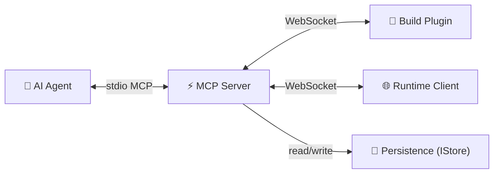

# Harnessa-FE Architecture

## Layers



| Layer | Package | Responsibility |
|-------|---------|---------------|
| Build Plugin | `@harnessa-fe/vite` / `.webpack` | Source-aware transform at build time; forward HMR + Node.js logs; report `projectId` / `buildId` / `parentProjectId` to daemon |
| Runtime Client | `@harnessa-fe/runtime` | Capture browser events (console / network / errors / rrweb); execute agent commands; **inherit identity from same-origin parent iframe** |
| MCP Server | `@harnessa-fe/mcp-server` | Global daemon; bridges agent ↔ peers; owns persistence (`IStore`) + project tree |
| Unplugin Core | `@harnessa-fe/unplugin` | Shared transform + WebSocket lifecycle for every bundler; resolves `buildId` |
| Protocol | `@harnessa-fe/protocol` | Wire frames + Zod schemas + URL helpers |

The MCP server is a **global daemon** — not tied to any single project. Multiple projects share one process.

---

## Core narrative concepts

```
Project              ← stable identity for a codebase (UUID, .harnessa-id)
  ├─ parentProjectId? ← project tree, supports micro-frontends
  ├─ displayName?     ← human-readable label (defaults to package.json `name`)
  └─ Builds           ← one source-code snapshot per dev-server start / per prod build
        └─ buildId    ← stable across HMR, changes on restart / re-build

Tab                  ← one browser tab lifecycle (persists across refresh)
  └─ tabId           ← sessionStorage-backed; inherited from window.parent in same-origin iframes
       └─ Sessions   ← one page-load each (narrative unit for "what happened in one bug")
            └─ sessionId  ← regenerated on every navigation/refresh; inherited from parent for iframes
                 └─ events: console / network / rrweb / errors / commands
                          ← each row tagged with projectId + buildId
```

**Why this shape**: agent debugging asks "what happened in one user session, across all the apps that were running?". Answer = filter all events for a given `sessionId` (or `tabId`, or `projectId+descendants`).

### Same-origin iframe identity inheritance

When the runtime boots inside a same-origin iframe, `tryInheritFromParent()` reads:

- `window.parent.__harnessa_fe_client__.tabId` / `.sessionId`
- `window.parent.__hfe_session_id__` (fallback if client global isn't set yet)
- `window.parent.sessionStorage['__hfe_tab_id__']` (fallback)
- `window.parent.__HARNESSA_FE__.projectId` → reported as `parentProjectId`

Cross-origin parent → `SecurityError` caught silently → child generates its own identity.

The parent runtime exposes itself on `window.__harnessa_fe_client__` and `window.__hfe_session_id__` precisely so children can read these.

---

## Module Interactions

### Build Plugin → MCP Server

- Sends `hello` on startup: `{ projectId, parentProjectId?, displayName?, buildId }`
- Forwards HMR updates and Node.js stdout/stderr as event frames (each tagged with `buildId`)
- Responds to source-intelligence commands: `project.source` / `project.where_is` / `project.module_graph`

### Runtime Client → MCP Server

- Sends `hello` on page load: `{ projectId, parentProjectId?, displayName?, buildId, tabId, sessionId }`
- Streams `console.*`, `fetch`/XHR, `window.error`, `unhandledrejection` events; each tagged with `projectId` + `sessionId` + `buildId`
- Captures rrweb chunks for session replay
- Executes commands dispatched by the server (`page.click`, `page.type`, …)

### MCP Server → AI Agent (stdio MCP tools)

Tool groups:

| Group | Tools |
|---|---|
| Page interaction | `page.click` / `type` / `scroll` / `navigate` / `reload` / `evaluate` / `wait_for` / `screenshot` / `dom_query` / `pick_element` |
| Telemetry | `console.tail` / `network.tail` / `errors.tail` |
| Session replay | `session.recordings.list` / `slice` / `replay.create` |
| Source intelligence | `project.source` / `where_is` / `module_graph` / `snapshot` |
| **Project tree** | `project.list` / `get` / `tree` / `set_parent` |
| **Builds** | `build.list` / `build.get` |
| Tasks | `tasks.pending` / `claim` / `resolve` |
| Memory | `project.memory.set` / `get` / `list` / `delete` |

---

## Persistence (`IStore`)

All data lives in `~/.harnessa/data/` — the daemon's global directory. Projects write only a single `.harnessa-id` to their own root.

### Disk layout (v0.2)

```
~/.harnessa/data/
└── {projectId}/
    ├── meta.json                       ProjectMeta — id, parentProjectId, displayName, tags
    ├── tasks.json
    ├── memory.json
    ├── builds/
    │   └── {buildId}/meta.json         BuildMeta — gitSha, dirty, bundler, sourceDigest
    └── sessions/                       (legacy "dev-server-run" bucket — being renamed in a future minor)
        └── {runId}/
            ├── meta.json
            ├── timeline.jsonl
            └── tabs/{tabId}/
                ├── meta.json
                ├── timeline.jsonl
                ├── loads.jsonl         (per-pageload meta = new "session" concept)
                └── recording.jsonl
```

> The narrative-level "session" (one page-load) currently lives in `loads.jsonl` for backwards compat with v0.1 storage. A future minor will rename it on disk to match the API.

### Storage strategy

- **Runtime events** (high-frequency time-series) → JSONL append-only, written via `WriteQueue` (single-writer-per-file)
- **Structured records** (CRUD) → JSON, atomic write-then-rename
- **In-memory state** — `SessionRouter` tracks active peers (live view); disk is the historical truth

### IStore interface (excerpt)

```ts
upsertProject(projectId, patch)         // merging; rejects parent-tree cycles
getProject(projectId)
listProjects()

upsertBuild(projectId, buildId, patch)
getBuild / listBuilds

getProjectTree(rootId?)                 // forest assembled from parentProjectId

openSession(...) / openTab / openLoad   // event-stream lifecycle
append / appendBatch / appendRecording  // events + rrweb
tail / search / listRecordings / sliceRecordings / sliceRecordingsByLoad
```

The interface is the boundary for future backends — `SqliteStore` / `PostgresStore` / `RemoteHttpStore` can implement the same shape without touching upstream code. The schema is SQL-friendly (see CHANGELOG `Unreleased` notes).

---

## Configuration

### URL-based (v0.2+)

A single env var governs the daemon ↔ plugin handshake:

| Env var | Default | Meaning |
|---|---|---|
| `HARNESSA_FE_URL` | `ws://127.0.0.1:47729` | WebSocket URL the daemon listens on AND the plugins/runtimes connect to |

The plugin can also accept an explicit option:

```ts
harnessaFE({ mcpUrl: 'ws://10.0.0.5:9000' })
```

Resolution order (highest first):

1. `harnessaFE({ mcpUrl: '…' })` plugin option
2. `HARNESSA_FE_URL` env var
3. Default `ws://127.0.0.1:47729`

Earlier `HARNESSA_FE_HOST` + `HARNESSA_FE_PORT` were dropped in favor of the single URL.

---

## Key design decisions

- **Single source of truth on disk** — events are append-only JSONL; indexes are derivable, not persisted. Multi-instance deployments share storage without sync.
- **`IStore` is the only abstraction across implementations** — JSONL today, SQL tomorrow. No file-path leakage above the store.
- **`buildId` is independent of `sessionId`** — separates "which code ran" from "which page-load" so prod-style debugging works (`build.list`, future `build.timeline`).
- **Identity inheritance happens in the runtime, not on the wire** — protocol stays simple; iframe correlation is a client concern.
- **Unplugin** — one plugin codebase → Vite / Webpack / Rspack / esbuild / Rollup adapters
- **JSONL timeline** — agents read events linearly; no query DSL required
- **Global daemon** — MCP server isn't project-scoped; multiple projects share one process
- **`.harnessa-id`** — only file written into the user's project directory; everything else lives under `~/.harnessa/`
