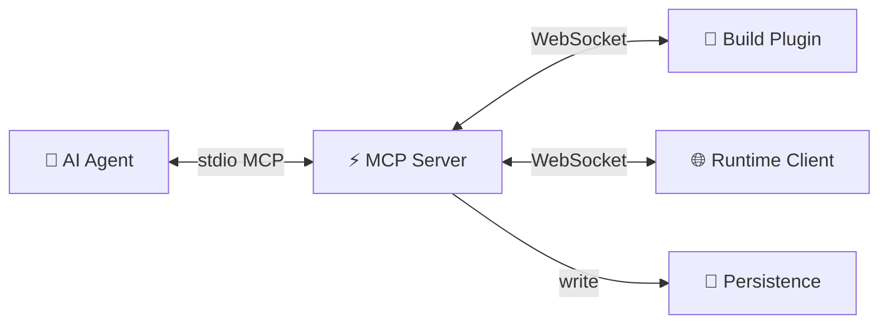

# Harnessa-FE Architecture

## Layers

| Layer | Package | Responsibility |
|-------|---------|---------------|
| Build Plugin | `@morphixai/harnessa-fe.vite` / `.webpack` | Source transform at build time; forward HMR and Node.js logs to MCP server |
| Runtime Client | `@morphixai/harnessa-fe.runtime` | Capture browser events (console, network, errors); execute agent commands in the page |
| MCP Server | `@morphixai/harnessa-fe.mcp-server` | Global daemon; bridge between AI agents and browser/plugin peers; owns all persistence |
| Unplugin Core | `@morphixai/harnessa-fe.unplugin` | Shared plugin logic (transform + WebSocket lifecycle) for all bundlers |
| Protocol | `@morphixai/harnessa-fe.protocol` | Shared frame types and schemas |

The MCP server is a **global daemon** — it is not tied to any single project and can serve multiple projects simultaneously.

---

## Core Concepts

**Project** — one frontend codebase. Identified by a generated ID stored in `{projectRoot}/.harnessa-id` (committed to git, shared across team).

**Session** — one run of the dev server (`pnpm dev` start to exit). Created when the build plugin connects; ends when it disconnects.

**Tab** — one browser tab with the dev page open. Identified by a UUID in `sessionStorage` (persists across page refreshes, cleared on tab close).

---

## Module Interactions

### Build Plugin → MCP Server
- Sends `hello` on startup with `projectId`
- Forwards HMR updates and Node.js stdout/stderr as event frames
- Responds to source intelligence commands (`project.source`, `project.where_is`, `project.module_graph`)

### Runtime Client → MCP Server
- Sends `hello` on page load with `projectId` and `tabId`
- Streams browser events (console, network, errors) as event frames
- Executes commands dispatched by the MCP server (`page.click`, `page.type`, etc.)

### MCP Server → AI Agent
- Exposes MCP tools over stdio
- Routes commands to the correct peer (runtime client or build plugin)
- Persists all events and structured records; serves historical queries

---

## Persistence

All data lives in `~/.harnessa/` — the MCP server's global data directory. Projects write only a single `.harnessa-id` file to their own directory.

Two data categories with different storage strategies:

**Runtime events** (time-series) → JSONL append-only files, organized by `project / session / tab`. Written via an in-memory queue with async batch flush to avoid blocking the event loop. Each event carries a server-assigned sequence number to preserve arrival order.

**Structured records** (CRUD) → JSON files per project. Includes annotation tasks (`tasks.json`) and agent memory (`memory.json`). Written synchronously due to low frequency.

---

## Key Design Decisions

- **Unplugin** — one plugin codebase generates adapters for Vite, Webpack, Rspack, esbuild, and Rollup
- **JSONL timeline** — all runtime events in one chronological stream; Agent-readable without a query language
- **Global daemon** — MCP server is not project-scoped; multiple projects share one process
- **IStore interface** — persistence backend is swappable; local JSONL today, remote DB in server mode
- **`.harnessa-id`** — only file written to the project directory; keeps the project clean
