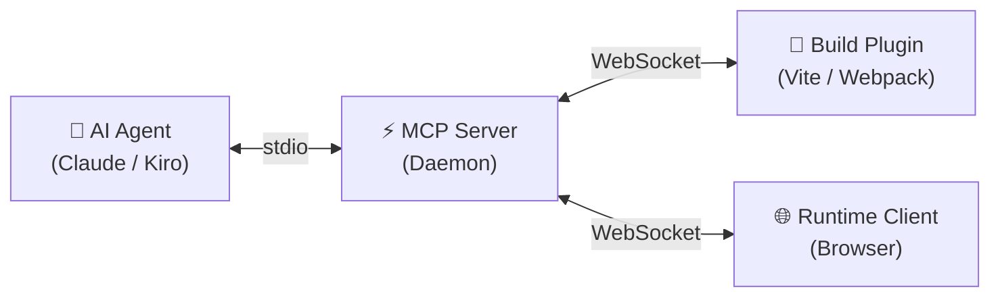

<p align="center">
  
</p>

<h1 align="center">Harnessa-FE</h1>

<p align="center">
  The frontend harness for AI agents. Source-aware Vite plugin + MCP daemon + runtime client — lets agents drive any page in the user's real browser with full-stack understanding.
</p>

<p align="center">
  <a href="https://github.com/Morphicai/harnessa-fe/actions/workflows/ci.yml"></a>
  <a href="./LICENSE"></a>
</p>

---

## Features

- **Source-Aware Instrumentation** — Injects `data-morphix-loc` and `data-morphix-comp` attributes into JSX/Vue elements at build time, giving AI agents precise file:line:column references for every UI element.
- **MCP Server Bridge** — A stdio-based MCP daemon that connects AI agents (Claude, Cursor, Kiro) to the browser runtime via WebSocket, enabling bidirectional command/event communication.
- **Runtime Client** — A lightweight browser SDK that captures DOM snapshots, handles annotation overlays, and executes agent commands in the user's real browser session.
- **Multi-Bundler Support** — Works with Vite (stable) and Webpack (in progress), sharing a common transform layer so every bundler gets the same instrumentation quality.
- **Framework Agnostic** — Supports React out of the box with Vue 3 support in progress. The component detection layer adapts to each framework's internals.
- **Zero Production Overhead** — All instrumentation, WebSocket connections, and runtime injection are automatically disabled in production builds.

## How It Works

Harnessa-FE uses a three-layer architecture to connect AI agents with your running application:



| Layer | Role | Communication |
|-------|------|---------------|
| **Build Plugin** | Transforms source files at dev-time, injecting location and component metadata into JSX/Vue templates. Sends HMR and error events to the MCP server. | WebSocket → MCP Server |
| **Runtime Client** | Runs in the browser, captures DOM snapshots, executes commands (click, type, query), and renders annotation overlays. | WebSocket → MCP Server |
| **MCP Server** | The central bridge. Exposes tools to AI agents via stdio MCP protocol and routes commands/events between agents and browser/plugin peers. | stdio ↔ AI Agent, WebSocket ↔ Peers |

**Data flow:** Bundler transforms source → Browser renders instrumented DOM → Runtime captures state → MCP Server relays to AI Agent → Agent sends commands back through the same path.

## Supported Environments

| Environment | Version | Status |
|-------------|---------|--------|
| Vite + React | 5.x – 7.x | ✅ Stable |
| Webpack + React | 5.x | 🟡 Beta |
| Vite + Vue 3 | 5.x – 7.x | 🟡 Beta |
| Webpack + Vue 3 | 5.x | 🟡 Beta (build-time tagging works; runtime injection pending) |
| Next.js (Webpack) | 13+ | 📋 Planned |

## Getting Started

### Prerequisites

- **Node.js** >= 18
- **pnpm** >= 8 (recommended), npm >= 9, or yarn >= 1.22

### Installation

**pnpm** (recommended):
```bash
pnpm add -D @harnessa-fe/vite @harnessa-fe/runtime
```

**npm:**
```bash
npm install -D @harnessa-fe/vite @harnessa-fe/runtime
```

**yarn:**
```bash
yarn add -D @harnessa-fe/vite @harnessa-fe/runtime
```

### Quick Start (5 steps)

1. **Install packages** — Add the Vite plugin and runtime client to your project (see commands above).

2. **Configure Vite** — Add the plugin to your `vite.config.ts`:
   ```typescript
   import { defineConfig } from 'vite';
   import react from '@vitejs/plugin-react';
   import { harnessaFE } from '@harnessa-fe/vite';

   export default defineConfig({
     plugins: [react(), harnessaFE()],
   });
   ```

3. **Start the MCP server** — Run the daemon so AI agents can connect:
   ```bash
   npx @harnessa-fe/mcp-server
   ```

4. **Start your dev server** — Launch your app as usual:
   ```bash
   pnpm dev
   ```

5. **Connect your AI agent** — Configure your AI tool (Claude, Cursor, Kiro) to use the Harnessa-FE MCP server. The agent can now see and interact with your running application.

## Packages

| Package | Description |
|---------|-------------|
| [`@harnessa-fe/protocol`](./packages/protocol) | Shared types, schemas, and message definitions |
| [`@harnessa-fe/mcp-server`](./packages/mcp-server) | MCP daemon with WebSocket bridge |
| [`@harnessa-fe/runtime`](./packages/runtime-client) | Browser runtime client SDK |
| [`@harnessa-fe/vite`](./packages/vite-plugin) | Vite plugin |
| [`@harnessa-fe/webpack`](./packages/webpack-plugin) | Webpack plugin |
| [`@harnessa-fe/unplugin`](./packages/unplugin) | Core unplugin (shared by all bundler plugins) |

## Documentation

- [**CONTRIBUTING.md**](./CONTRIBUTING.md) — Development setup, commit conventions, and PR process
- [**ARCHITECTURE.md**](./ARCHITECTURE.md) — Package responsibilities, data flow diagrams, and protocol reference
- [**ROADMAP.md**](./ROADMAP.md) — Project milestones and planned features

## License

[MIT](./LICENSE) © 2025 MorphixAI
