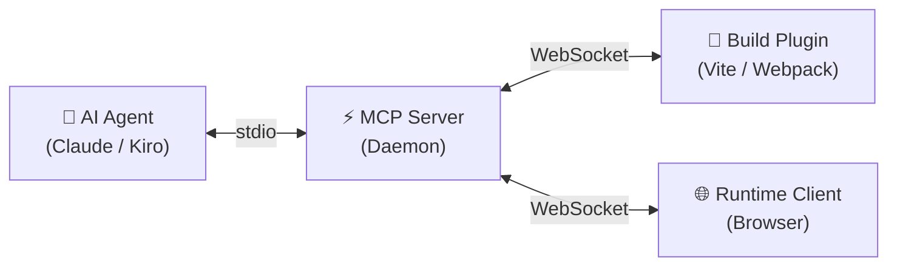

<p align="center">
  
</p>

<h1 align="center">Harnessa-FE</h1>

<p align="center">
  The frontend harness for AI agents. Source-aware Vite plugin + MCP daemon + runtime client — lets agents drive any page in the user's real browser with full-stack understanding.
</p>

<p align="center">
  <em>Building toward: every AI-coded app ships with the runtime that lets the agent that built it keep watching, listening, and fixing the app after it ships.</em> — see <a href="./VISION.md">VISION.md</a>
</p>

<p align="center">
  <a href="https://github.com/Morphicai/harnessa-fe/actions/workflows/ci.yml"></a>
  <a href="./LICENSE"></a>
</p>

---

## Features

- **Source-Aware Instrumentation** — Injects `data-morphix-loc` and `data-morphix-comp` attributes into JSX / Vue elements (via build plugin OR `@harnessa-fe/react-jsx` `jsxImportSource`), giving AI agents precise file:line:column references for every UI element.
- **MCP Server Bridge** — A stdio-based MCP daemon that connects AI agents (Claude, Cursor, Kiro) to browser + server runtimes via WebSocket / HTTP, enabling bidirectional command/event communication and a unified timeline per page-load.
- **Browser Runtime + Overlay** — A lightweight browser SDK that captures console / network / errors / DOM (rrweb), exposes an in-page "H" overlay so users can file annotated screenshots (arrow + text on a snapdom-captured PNG), and surfaces a "My reports" view to manage their submissions.
- **Server-Side Capture (Next.js)** — `@harnessa-fe/node-runtime` collects Server Component errors, Route Handler / Server Action durations, and uncaught Node exceptions. `<HarnessaScript>` is a Server Component that uses React `cache()` to bind the **same sessionId** across SSR and the client runtime — one refresh = one `sessions/{id}/timeline.jsonl`.
- **Edge Runtime Compatible** — When Next emits an Edge worker bundle the SDK auto-switches to an HTTP-batch transport (`POST /events` on the daemon) so Cloudflare Workers / Vercel Edge routes flow into the same daemon as Node routes.
- **Visitor Identity** — Anonymous, stable per-browser identifier (`localStorage`) + optional `userId` from the app's auth layer. Lets agents build a real user journey across refreshes, tabs, and same-origin iframes.
- **Annotated Feedback Loop** — Users file tasks through the overlay; the screenshot's arrow + text annotations are flattened into the PNG so vision models read the annotations directly off pixels. Agents fetch the image via `tasks_get_attachment` as a native MCP image-content block.
- **Multi-Bundler & Multi-Framework** — Stable on Vite + React, Webpack + React, Vite/Webpack + Vue 3, Next.js (App + Pages Router, webpack + Turbopack). Any React 17+ toolchain via `@harnessa-fe/react-jsx` `jsxImportSource`.
- **Zero Production Overhead** — All instrumentation, WebSocket / HTTP connections, the overlay, and the Node SDK are gated behind `NODE_ENV === 'development'`.

## How It Works

Harnessa-FE uses a three-layer architecture to connect AI agents with your running application:



| Layer | Role | Communication |
|-------|------|---------------|
| **Build Plugin** | Transforms source files at dev-time, injecting location and component metadata into JSX/Vue templates. Sends HMR and error events to the MCP server. | WebSocket → MCP Server |
| **Runtime Client** | Runs in the browser, captures DOM snapshots, executes commands (click, type, query), and renders annotation overlays. | WebSocket → MCP Server |
| **MCP Server** | The central bridge. Exposes tools to AI agents via stdio MCP protocol and routes commands/events between agents and browser/plugin peers. | stdio ↔ AI Agent, WebSocket ↔ Peers |

**Data flow:** Bundler transforms source → Browser renders instrumented DOM → Runtime captures state → MCP Server relays to AI Agent → Agent sends commands back through the same path.

## Supported Environments

| Environment | Version | Status |
|-------------|---------|--------|
| Vite + React | 5.x – 7.x | ✅ Stable (`@harnessa-fe/vite`) |
| Webpack + React | 5.x | ✅ Stable (`@harnessa-fe/webpack`) |
| Vite + Vue 3 | 5.x – 7.x | ✅ Stable |
| Webpack + Vue 3 | 5.x | ✅ Stable |
| Next.js (App + Pages Router) | 13+ | ✅ Stable (`@harnessa-fe/next` + `@harnessa-fe/react-jsx`) |
| Any React toolchain (Remix, Astro, Turbopack, …) | React 17+ | ✅ Stable via `@harnessa-fe/react-jsx` jsxImportSource |

## Getting Started

### Prerequisites

- **Node.js** >= 18
- **pnpm** >= 8 (recommended), npm >= 9, or yarn >= 1.22

### Installation

**pnpm** (recommended):
```bash
pnpm add -D @harnessa-fe/vite @harnessa-fe/runtime
```

**npm:**
```bash
npm install -D @harnessa-fe/vite @harnessa-fe/runtime
```

**yarn:**
```bash
yarn add -D @harnessa-fe/vite @harnessa-fe/runtime
```

### Quick start — Vite + React (5 steps)

1. **Install packages**:
   ```bash
   pnpm add -D @harnessa-fe/vite @harnessa-fe/runtime
   ```

2. **Configure Vite** — add the plugin to your `vite.config.ts`:
   ```typescript
   import { defineConfig } from 'vite';
   import react from '@vitejs/plugin-react';
   import { harnessaFE } from '@harnessa-fe/vite';
   export default defineConfig({ plugins: [react(), harnessaFE()] });
   ```

3. **Start the MCP server** — `npx @harnessa-fe/mcp-server`
   - Local-only by default. For phone / second-machine debugging:
     `npx @harnessa-fe/mcp-server --host 0.0.0.0 --token auto`
     ([details](docs/lan-mode.md))
4. **Start your dev server** — `pnpm dev`
5. **Connect your AI agent** — register the MCP server in your AI tool (Claude Code, Cursor, Kiro). The agent now sees and drives your running app.

> **Adopting in legacy Vue projects?** See [docs/vue2-compat.md](docs/vue2-compat.md)
> — the plugin will never break your build, but you may want to dry-run
> first to see which files miss out on source-aware tagging.

### Quick start — Next.js (App or Pages Router)

For Next.js the recommended path is **plugin-less** (via `react-jsx` for source tagging + `next` for SSR session continuity). Two file touches.

1. **Install**:
   ```bash
   pnpm add -D @harnessa-fe/next @harnessa-fe/react-jsx @harnessa-fe/runtime @harnessa-fe/node-runtime
   ```

2. **`tsconfig.json`** — enable the source-tag JSX runtime:
   ```jsonc
   { "compilerOptions": { "jsxImportSource": "@harnessa-fe/react-jsx" } }
   ```

3. **`next.config.mjs`** — wrap with `withHarnessa()`:
   ```ts
   import { withHarnessa } from '@harnessa-fe/next/config';
   export default withHarnessa({/* …your config… */}, { projectId: 'my-app' });
   ```

4. **`app/layout.tsx`** — drop in the Server Component (yes, no `'use client'` needed):
   ```tsx
   import { HarnessaScript } from '@harnessa-fe/next';
   import { getCurrentUser } from '@/lib/auth';
   export default async function RootLayout({ children }) {
       const user = await getCurrentUser().catch(() => null);
       return (
           <html><body>
               <HarnessaScript
                   projectId="my-app"
                   userId={user?.id}
                   buildId={process.env.NEXT_PUBLIC_GIT_SHA}
               />
               {children}
           </body></html>
       );
   }
   ```

5. **Run the daemon** + **`pnpm dev`**. Two `peer connected` lines should show in the daemon log per refresh — one `role=node-runtime`, one `role=runtime-client`, **same sessionId**.

### Optional — structured logs with `@harnessa-fe/log`

For explicit logs (instead of relying on auto-captured `console.*`), use the isomorphic logger. Same import works in Server Components, Route Handlers, Server Actions, and Client Components — events from both server and client land in the same session timeline.

```bash
pnpm add @harnessa-fe/log
```

```tsx
import { log } from '@harnessa-fe/log';

// Anywhere — Server Component, Route Handler, Client Component, shared util
log.info('Cart loaded', { items: items.length });
log.scope('checkout').warn('Stripe latency high', { ms: latency });
log.error('Webhook failed', err);
```

Agents can ask "show me all `log.warn(...)` in this session" because `log` events are tagged `app-log` — distinct from auto-captured `server-log` / browser `console`. See [`packages/log/README.md`](./packages/log/README.md) for details.

### User feedback (in-page overlay)

When the runtime loads in dev a discreet "H" mark appears bottom-right. Clicking opens the info card. From there users can:

- **Copy snapshot** — markdown block with project / build / session / tab / url ready to paste to an agent.
- **Report a problem** — picks an element → `snapdom` captures it with 32 px context → user draws arrows + text → flattened PNG ships as part of a `task.submit` event. Vision-capable agents read the annotations directly off the pixels.
- **My reports** — list of this visitor's tasks across all sessions: status, agent's resolution note, inline edit, copy-for-agent, delete with two-click confirm.

## Packages

| Package | Description |
|---------|-------------|
| [`@harnessa-fe/protocol`](./packages/protocol) | Shared types, Zod schemas, message + wire definitions |
| [`@harnessa-fe/mcp-server`](./packages/mcp-server) | MCP daemon — WS bridge + HTTP `POST /events` for Edge + dashboard + replay viewer |
| [`@harnessa-fe/runtime`](./packages/runtime-client) | Browser SDK — capture, rrweb, overlay, "Report a problem", "My reports" |
| [`@harnessa-fe/node-runtime`](./packages/node-runtime) | Node SDK — Server Component / Route Handler / uncaught error capture. Dual transport: WS in Node runtime, HTTP-batch in Edge runtime |
| [`@harnessa-fe/next`](./packages/next) | Next.js integration — `<HarnessaScript>` server component, `withHarnessa()` next-config wrapper |
| [`@harnessa-fe/log`](./packages/log) | Isomorphic structured logger — same `log.info/warn/error` works in Server Components, Route Handlers, and Client Components; same `sessionId` everywhere |
| [`@harnessa-fe/react-jsx`](./packages/react-jsx) | `jsxImportSource` runtime — source-aware tagging for ANY React toolchain, no bundler plugin needed |
| [`@harnessa-fe/vite`](./packages/vite-plugin) | Vite plugin |
| [`@harnessa-fe/webpack`](./packages/webpack-plugin) | Webpack plugin |
| [`@harnessa-fe/unplugin`](./packages/unplugin) | Core unplugin (shared by all bundler plugins) |
| [`@harnessa-fe/skill`](./packages/agent-skill) | Curated agent playbook — install into Claude Code / Cursor / Kiro to teach the agent how to use harnessa-fe |

## Documentation

- [**VISION.md**](./VISION.md) — Why this project exists; the three deployment directions that drive the roadmap
- [**ARCHITECTURE.md**](./ARCHITECTURE.md) — Package responsibilities, data flow diagrams, sessionId resolution chain, and protocol reference
- [**ROADMAP.md**](./ROADMAP.md) — Milestones, organised by mission direction
- [**docs/troubleshooting.md**](./docs/troubleshooting.md) — Events not showing? sessionId mismatch? Where do timeline files live? Start here
- [**CONTRIBUTING.md**](./CONTRIBUTING.md) — Development setup, commit conventions, and PR process

## License

[MIT](./LICENSE) © 2025 MorphixAI
