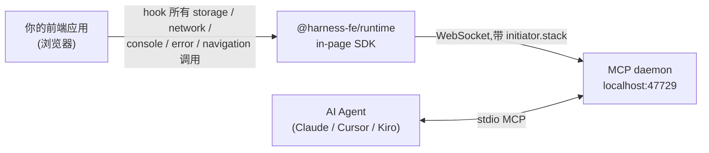

# Chrome DevTools 不好用?不妨试试 Harness-FE

周三下午,我正在调一个新的鉴权流程。本地点开 dashboard,刷新两次,屏幕中间冷不丁弹出来一句:

> **"登录态已失效,请重新登录。"**

我心里咯噔一下。

重新登录,继续点。一分钟,弹窗又跳出来。

第三次了。


<!-- 待替换:/blog/images/2026-05-28-devtools-vs-harness/01-user-report.png
浏览器截图 + 弹窗 / Toast 风格,内容 "登录态已失效,请重新登录"。背景是
开发中的 dashboard 页面,URL 栏可以看到 localhost:5173。建议尺寸 1200×600。 -->

## F12,这是肌肉记忆吧?

熟悉的招式,一套一套来。

**第一招,Application 标签看 localStorage。**


<!-- 待替换:/blog/images/2026-05-28-devtools-vs-harness/02-devtools-application.png
Chrome DevTools 的 Application → Local Storage 视图,显示 auth_token 那一行
是空的。给个红框高亮 "(empty)" 状态。建议 1400×800。 -->

`auth_token` 是空的。

——但这只告诉我**结果**,看不见**过程**。谁删的?什么时候删的?为什么删?

DevTools 给不了答案。

**第二招,Sources 设断点。** 我先 git grep 一下:

```bash
$ git grep -n 'removeItem\|localStorage\.clear\|Cookies\.remove' src/ | wc -l
27
```

27 处。你感受一下。

挨个打上 conditional breakpoint,然后刷新、登录、点点点……希望能蹲到一次。

一个小时过去了,什么都没触发。复现概率太低。

**第三招,console.log 大法。** 直接 monkey-patch:

```ts
const _orig = localStorage.removeItem.bind(localStorage);
localStorage.removeItem = function (key) {
    console.trace('removeItem called:', key);
    _orig(key);
};
```

侵入式,改完代码——然后 Vite 热更新了一次,window 被重置,patch 没了。

重新登录,再试。

到这里,我已经花了 90 分钟。连 bug 在哪都不知道。

## 问题真的在 DevTools 吗?

其实不在。

DevTools 是给"开发者亲自盯着屏幕看"设计的工具。它的全部交互假设都建立在**有一个人坐在前面**:

- Network 标签——你要自己点开看哪个请求
- Sources 断点——你要自己想清楚在哪一行停下来
- Console——你要自己 grep 一遍找证据
- Application——你要自己知道哪个 key 重要

可是说真的,我们大部分调试时间已经不是这样了。

我们打开 Claude Code、Cursor,先扔一句"帮我看下这个 bug",然后让 agent 干活。

但 agent 看不见我能看见的东西——它没有 F12,没有 Network 标签,没有 Application 视图。它只能读源代码,然后**猜**。

## 那就给 agent 装上眼睛

[Harness-FE](https://harness-fe.com) 的想法其实很简单:把 DevTools 暴露的所有信息——console、network、localStorage、cookie、navigation、错误堆栈、DOM 录制——全部**结构化、带 metadata、可以被 agent 直接调用**。

而且关键是:**每一个事件都带 `initiator.stack`**——发起这个事件的 JS 调用栈。

这是 DevTools 永远不会主动告诉你的。

回到我刚才那个 bug。

我打开 Claude Code,说了一句:

> "我在 dashboard 反复被踢出登录,帮我查下 token 是被谁清掉的"

Agent 调了一个工具:

```
> storage_tail({ op: 'remove', key: 'auth_token' })
```

返回:

```json
[
  {
    "ts": "2026-05-28 14:47:32.108",
    "op": "remove",
    "key": "auth_token",
    "initiator": {
      "stack": [
        "src/lib/api/interceptor.ts:47:12  handle401Response",
        "src/lib/api/interceptor.ts:23:8   axiosInstance.interceptors.response.use",
        "node_modules/axios/lib/..."
      ]
    }
  }
]
```


<!-- 待替换:/blog/images/2026-05-28-devtools-vs-harness/03-agent-storage-tail.png
Claude Code 终端样式截图。左侧是 user prompt,右侧是 agent 的 tool call
JSON 输出。高亮 initiator.stack 那几行。建议 1600×900,深色终端配色。 -->

Stack 顶端的 user-code 帧:`src/lib/api/interceptor.ts:47`。

Agent 顺手又调了一个工具读源码:

```
> project_source({ file: 'src/lib/api/interceptor.ts', startLine: 40, endLine: 55 })
```

```ts
axiosInstance.interceptors.response.use(
    (response) => response,
    (error) => {
        if (error.response?.status === 401) {
            // ⚠️ 任何 401 都登出
            localStorage.removeItem('auth_token');
            window.location.assign('/login');
        }
        return Promise.reject(error);
    }
);
```

Agent 给出诊断:

> 第 47 行无差别处理所有 401 响应。但 `/api/avatar/by-uid` 在用户没头像时也会返回 401(这是后端的 bug),导致 dashboard 渲染头像列表的时候,你被误登出。
>
> 建议:把清 token 的逻辑收紧到 `/api/auth/*` 路径下,或者把 `/api/avatar/*` 移到不需要鉴权的路由。

从问题到根因到方案——**90 秒**。

我看了一眼时钟,刚才那 90 分钟,有点像做了一场梦。


<!-- 待替换:/blog/images/2026-05-28-devtools-vs-harness/04-time-comparison.png
两根横向时间条对比。第一根 "DevTools workflow" 长度约 120 分钟,分段为
"Application 看状态 / Sources 打断点 / 复现等待 / Monkey-patch / 还是没找到"。
第二根 "Harness-FE workflow" 长度约 90 秒,分段为 "storage_tail / read
source / propose fix"。Morphix 品牌蓝 #005EFF 作为强调色。建议 1400×500。 -->

## 它为什么能知道这些?

简单画一下机制:



四个关键差异:

1. **运行时插桩**——打包阶段插桩一遍源码,JSX 元素都带 `data-morphix-loc="src/Form.tsx:42:8"`,agent 不用猜文件位置
2. **事件 + stack**——每个浏览器副作用(storage 写、fetch、WebSocket 发送、navigation)都伴随抓取的 JS 调用栈
3. **本地长驻 daemon**——数据不上云,跨 session、跨 tab 持续观察。HMR 不会重置,改完代码再点一次就能对比新旧 timeline
4. **MCP 协议**——agent 直接当工具调用,Claude Code / Cursor / Kiro / Windsurf 都通用

整套东西安装只要一行:

```bash
npx @harness-fe/skill install
```

Skill 文件会被丢到 `.claude/skills/harness-fe/`(或 cursor / kiro 对应目录),agent 下次会话就知道何时调用哪个工具。然后你只要扔一句话:

> "在这个项目里接入 Harness-FE。"

它会自己装 build 插件、写 MCP daemon 配置。剩下的就是聊天。

## 不止 storage

我用同样的方式,这周还顺手解决了几个:

**"refactor 完表单,保存按钮没反应"**

```
> page_click({ selector: { component: 'SaveButton' } })
> network_tail({ filter: { url: '/api/' }, n: 5 })
```

POST 打到了 `/api/setting`(单数),实际应该是 `/api/settings`。Refactor 时漏了一个 `s`。`initiator.stack` 直接指向 `useSettings.ts:23`。


<!-- 待替换:/blog/images/2026-05-28-devtools-vs-harness/05-network-source.png
左半屏 Claude Code 的 network_tail 输出,显示一行 POST /api/setting 404。
右半屏对应的源码 useSettings.ts:23 高亮 `${API}/setting` 那一行,标注
"missing 's'"。建议 1600×800。 -->

**"我自己测了三次,行为都不一样"**

```
> session_tail({ types: ['storage', 'network', 'navigation'], since: '2m' })
```

两分钟内所有副作用按时间线排出来,跟我点击的步骤一对——哪一步是 race condition 触发的,一目了然。HMR 不会重置这些数据(它们在 daemon 进程里),改完代码再点一次,直接对比新旧 timeline。

**"开发时开第二个 tab 调试,第一个 tab 突然登出"**

```
> visitor.timeline({ visitorId, types: ['ws', 'storage', 'navigation'], since: '5m' })
```

同浏览器跨 tab 因果链,一条命令:tab B 收到 ws 推送 `force_logout` → tab B 清 token → StorageEvent 同步到 tab A → tab A 的 AuthGuard 跳登录页。

调多 tab 共享态(SSO / 协同 / 实时推送)极常见。DevTools 要开两个窗口手动对齐。这里一条命令。

**"Next.js dev server 启动后 hydration mismatch,错误指着 `<html>` 元素"**

```
> session.timeline({ sessionId, types: ['server-err', 'error'] })
```

Server Component 的渲染错误和客户端 hydration 错误在同一条时间轴上,sessionId 一致。

再也不用左屏看 dev server 终端、右屏看浏览器 console,猜哪两条 log 对得上。

## DevTools 没死,只是不够用了

我不是来宣布"Chrome DevTools 已死"的。

任何需要你**亲自盯着屏幕**调试的场景——Sources 单步跟、Performance 录制、Memory snapshot——DevTools 还是最快的。Harness-FE 不替代,也不该替代。

但今天我们一半以上的调试时间,实际上是**让 agent 替我们看一眼**。

这一半时间里,DevTools 帮不上忙——它的所有信息都困在浏览器 UI 里,出不去。

Harness-FE 就是把这一半时间填上的。

::: tip 题外话:它不是 APM
Harness-FE 的 runtime 只在 dev build 注入。生产构建里**完全不存在**——零运行时开销,零隐私顾虑。它不取代 Sentry / Datadog,也不打算取代。它就是你和 agent 一起调试**本地代码**的工具。
:::

## 试一下

```bash
# 1. 装 skill
npx @harness-fe/skill install

# 2. 让 agent 接入(它会自己装 vite/webpack 插件 + 配 MCP)
# Claude Code / Cursor / Kiro 里说:
"在这个项目里接入 Harness-FE"

# 3. 跑起来
npx @harness-fe/mcp-server &
pnpm dev
```

打开 `http://localhost:47729/dashboard` 看一眼。绿色 "connected" 小点亮了就成。

——

- **文档**:[harness-fe.com](https://harness-fe.com)(English / 简体中文)
- **GitHub**:[Morphicai/harness-fe](https://github.com/Morphicai/harness-fe)(MIT)
- **完整工具目录**:[harness-fe.com/zh/reference/mcp-tools](https://harness-fe.com/zh/reference/mcp-tools)
- **故障排查**:[harness-fe.com/zh/guide/troubleshooting](https://harness-fe.com/zh/guide/troubleshooting)

——

与其等着 bug 自己复现,不如让 agent 替你看一眼。
